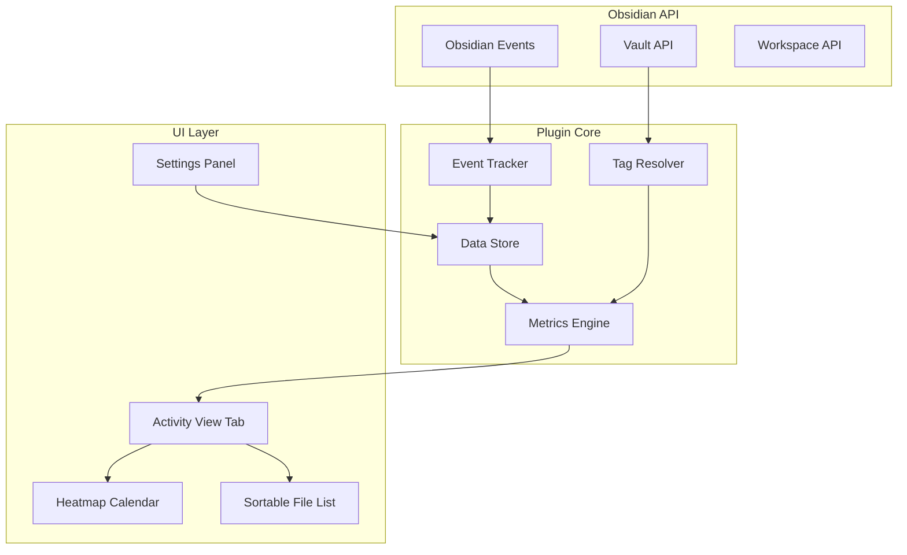
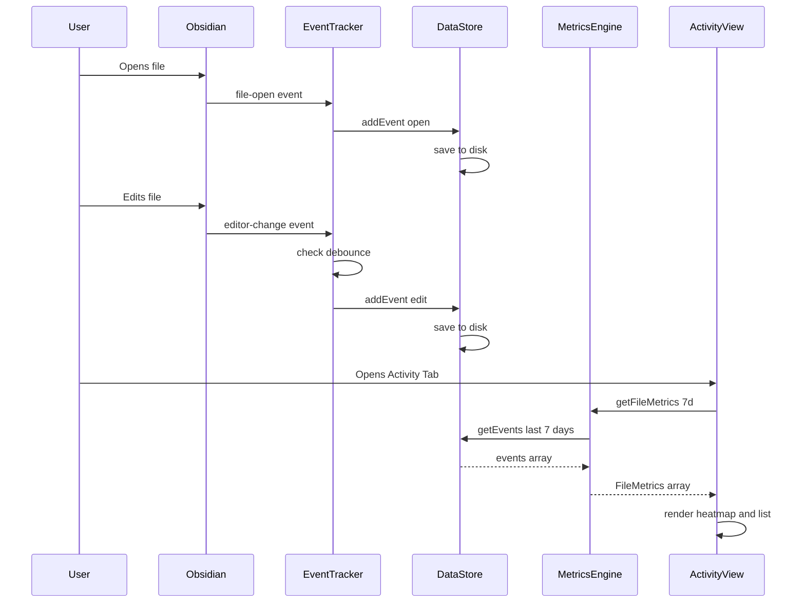

# Obsidian Activity Heatmap Plugin - Architecture

## Overview

This plugin tracks and visualizes document activity in Obsidian, providing metrics for:
- Document/folder open frequency
- Document/folder edit frequency
- Tag-based activity metrics
- Heatmap calendar visualization

## Core Requirements

| Requirement | Specification |
|-------------|---------------|
| Time periods | 7 days, 30 days, 90 days |
| Data retention | 1 year of history |
| UI | Dedicated view tab |
| Folder metrics | Aggregate of contained files |
| Visualization | Heatmap calendar |

---

## Architecture Diagram



---

## Data Structures

### Activity Event

```typescript
interface ActivityEvent {
    timestamp: number;      // Unix timestamp in milliseconds
    filePath: string;       // Full path to the file
    eventType: 'open' | 'edit';
}
```

### Stored Data Format

```typescript
interface PluginData {
    version: number;
    events: ActivityEvent[];
    lastCleanup: number;    // Last time old events were purged
}
```

### Computed Metrics

```typescript
interface FileMetrics {
    filePath: string;
    fileName: string;
    folderPath: string;
    tags: string[];
    openCount: number;
    editCount: number;
    lastOpened: number | null;
    lastEdited: number | null;
}

interface FolderMetrics {
    folderPath: string;
    folderName: string;
    totalOpenCount: number;
    totalEditCount: number;
    fileCount: number;
}

interface TagMetrics {
    tag: string;
    openCount: number;
    editCount: number;
    fileCount: number;
}

interface DailyActivity {
    date: string;           // YYYY-MM-DD format
    openCount: number;
    editCount: number;
}
```

---

## Component Design

### 1. Event Tracker

**Responsibility**: Capture file open and edit events from Obsidian.

**Obsidian Events to Hook**:
- `file-open` - Triggered when a file is opened
- `editor-change` - Triggered when content is modified (debounced)
- `modify` on Vault - Alternative for tracking modifications

**Implementation Notes**:
- Debounce edit events to avoid excessive logging (e.g., 30 seconds between same-file edits)
- Ignore non-markdown files (configurable)
- Store events immediately to prevent data loss

```typescript
class EventTracker {
    private lastEditTime: Map<string, number>;
    private readonly EDIT_DEBOUNCE_MS = 30000;

    onFileOpen(file: TFile): void;
    onFileEdit(file: TFile): void;
    private shouldRecordEdit(filePath: string): boolean;
}
```

### 2. Data Store

**Responsibility**: Persist activity data and manage data lifecycle.

**Features**:
- Save events to `data.json` in plugin folder
- Automatic cleanup of events older than 1 year
- Efficient querying by time range

```typescript
class DataStore {
    private data: PluginData;

    async load(): Promise<void>;
    async save(): Promise<void>;

    addEvent(event: ActivityEvent): void;
    getEvents(startTime: number, endTime: number): ActivityEvent[];

    cleanup(): void;  // Remove events older than 1 year
}
```

### 3. Metrics Engine

**Responsibility**: Calculate metrics from raw events.

**Features**:
- Aggregate events by file, folder, or tag
- Support multiple time periods
- Efficient caching of computed metrics

```typescript
class MetricsEngine {
    constructor(dataStore: DataStore, vault: Vault);

    getFileMetrics(period: TimePeriod): FileMetrics[];
    getFolderMetrics(period: TimePeriod): FolderMetrics[];
    getTagMetrics(period: TimePeriod): TagMetrics[];
    getDailyActivity(period: TimePeriod): DailyActivity[];

    // Sorting helpers
    sortByOpenCount(metrics: FileMetrics[]): FileMetrics[];
    sortByEditCount(metrics: FileMetrics[]): FileMetrics[];
}

type TimePeriod = '7d' | '30d' | '90d' | 'all';
```

### 4. Tag Resolver

**Responsibility**: Extract tags from files for tag-based metrics.

**Implementation**:
- Parse frontmatter YAML for tags
- Parse inline tags (#tag format)
- Cache tag mappings for performance

```typescript
class TagResolver {
    constructor(vault: Vault, metadataCache: MetadataCache);

    getFileTags(filePath: string): string[];
    getFilesByTag(tag: string): string[];
    getAllTags(): string[];
}
```

### 5. Activity View - UI Layout

**Responsibility**: Display metrics in a dedicated view tab.

**Layout**:
```
+----------------------------------------------------------+
|  Activity Tracker                              [Settings] |
+----------------------------------------------------------+
|  Period: [7 days v]  Metric: [Opens v]  View: [Files v]  |
+----------------------------------------------------------+
|                                                          |
|  +----------------------------------------------------+  |
|  |         Heatmap Calendar                           |  |
|  |  Mon ░░▓▓░░▓▓▓▓░░░░▓▓░░▓▓▓▓░░░░▓▓░░▓▓▓▓░░░░      |  |
|  |  Tue ▓▓░░▓▓░░▓▓▓▓░░░░▓▓░░▓▓▓▓░░░░▓▓░░▓▓▓▓░░      |  |
|  |  Wed ░░▓▓▓▓░░▓▓░░▓▓▓▓░░░░▓▓░░▓▓▓▓░░░░▓▓░░▓▓      |  |
|  |  ...                                               |  |
|  +----------------------------------------------------+  |
|                                                          |
|  +----------------------------------------------------+  |
|  |  File/Folder List                    Sort: v       |  |
|  +----------------------------------------------------+  |
|  |  [file] Daily Notes/2024-01-15.md      Opens: 45  |  |
|  |  [file] Projects/ProjectA.md           Opens: 32  |  |
|  |  [folder] Daily Notes/                 Opens: 128 |  |
|  |  [file] Ideas/NewIdea.md               Opens: 28  |  |
|  |  ...                                               |  |
|  +----------------------------------------------------+  |
|                                                          |
+----------------------------------------------------------+
```

**Components**:

```typescript
class ActivityView extends ItemView {
    getViewType(): string;
    getDisplayText(): string;

    async onOpen(): Promise<void>;
    async onClose(): Promise<void>;

    private renderHeader(): void;
    private renderHeatmap(): void;
    private renderFileList(): void;

    // State
    private currentPeriod: TimePeriod;
    private currentMetric: 'opens' | 'edits';
    private currentView: 'files' | 'folders' | 'tags';
    private sortOrder: 'asc' | 'desc';
}
```

### 6. Heatmap Calendar Component

**Responsibility**: Render GitHub-style activity heatmap.

**Features**:
- Show activity intensity by color
- Configurable color scheme
- Tooltip on hover showing exact counts
- Click to filter list by date

```typescript
class HeatmapCalendar {
    constructor(container: HTMLElement, data: DailyActivity[]);

    render(): void;
    setColorScheme(scheme: ColorScheme): void;
    onDayClick(callback: fn_date_string_void): void;
}

interface ColorScheme {
    empty: string;
    low: string;
    medium: string;
    high: string;
    max: string;
}
```

### 7. Settings Panel

**Responsibility**: Configure plugin behavior.

**Settings**:

| Setting | Type | Default | Description |
|---------|------|---------|-------------|
| editDebounceMs | number | 30000 | Minimum time between edit events for same file |
| trackedExtensions | string[] | ['.md'] | File extensions to track |
| excludedFolders | string[] | [] | Folders to exclude from tracking |
| colorScheme | ColorScheme | green | Heatmap color scheme |
| retentionDays | number | 365 | How long to keep event data |

```typescript
interface PluginSettings {
    editDebounceMs: number;
    trackedExtensions: string[];
    excludedFolders: string[];
    colorScheme: 'green' | 'blue' | 'purple' | 'orange';
    retentionDays: number;
}
```

---

## File Structure

```
obsidian-activity-heatmap/
├── src/
│   ├── main.ts                 # Plugin entry point
│   ├── types.ts                # TypeScript interfaces
│   ├── EventTracker.ts         # Event capture logic
│   ├── DataStore.ts            # Data persistence
│   ├── MetricsEngine.ts        # Metrics calculation
│   ├── TagResolver.ts          # Tag extraction
│   ├── ui/
│   │   ├── ActivityView.ts     # Main view component
│   │   ├── HeatmapCalendar.ts  # Heatmap rendering
│   │   ├── FileList.ts         # Sortable file list
│   │   └── SettingsTab.ts      # Settings panel
│   └── utils/
│       ├── dateUtils.ts        # Date manipulation helpers
│       └── colorUtils.ts       # Color scheme helpers
├── styles.css                  # Plugin styles
├── manifest.json               # Obsidian plugin manifest
├── package.json                # NPM package config
├── tsconfig.json               # TypeScript config
├── esbuild.config.mjs          # Build configuration
└── README.md                   # Documentation
```

---

## Data Flow



---

## Implementation Phases

### Phase 1: Core Infrastructure
1. Set up project structure with TypeScript and esbuild
2. Implement `DataStore` with basic save/load
3. Implement `EventTracker` with file-open and edit detection
4. Create basic plugin manifest and entry point

### Phase 2: Metrics Engine
1. Implement `MetricsEngine` for file metrics
2. Add folder aggregation logic
3. Implement `TagResolver` for tag extraction
4. Add tag-based metrics

### Phase 3: User Interface
1. Create `ActivityView` as dedicated view tab
2. Implement `HeatmapCalendar` component
3. Implement sortable `FileList` component
4. Add period and metric selectors

### Phase 4: Settings and Polish
1. Create `SettingsTab` with all configuration options
2. Add data cleanup/retention logic
3. Add keyboard shortcuts
4. Performance optimization and testing

---

## Technical Considerations

### Performance
- **Event Storage**: Use append-only log for events, batch saves every 5 seconds
- **Metrics Caching**: Cache computed metrics, invalidate on new events
- **Large Vaults**: Lazy load file list, virtualize long lists

### Edge Cases
- **Renamed Files**: Track by path, metrics will reset for renamed files
- **Deleted Files**: Keep historical data, mark as deleted in UI
- **Sync Conflicts**: Handle duplicate events gracefully

### Obsidian API Usage
- Use `this.registerEvent()` for proper cleanup
- Use `this.app.vault.on()` for vault events
- Use `this.app.workspace.on()` for workspace events
- Use `this.app.metadataCache` for tag resolution

---

## Dependencies

| Package | Purpose |
|---------|---------|
| obsidian | Obsidian API types |
| typescript | Type safety |
| esbuild | Fast bundling |

No external runtime dependencies - pure TypeScript implementation.
